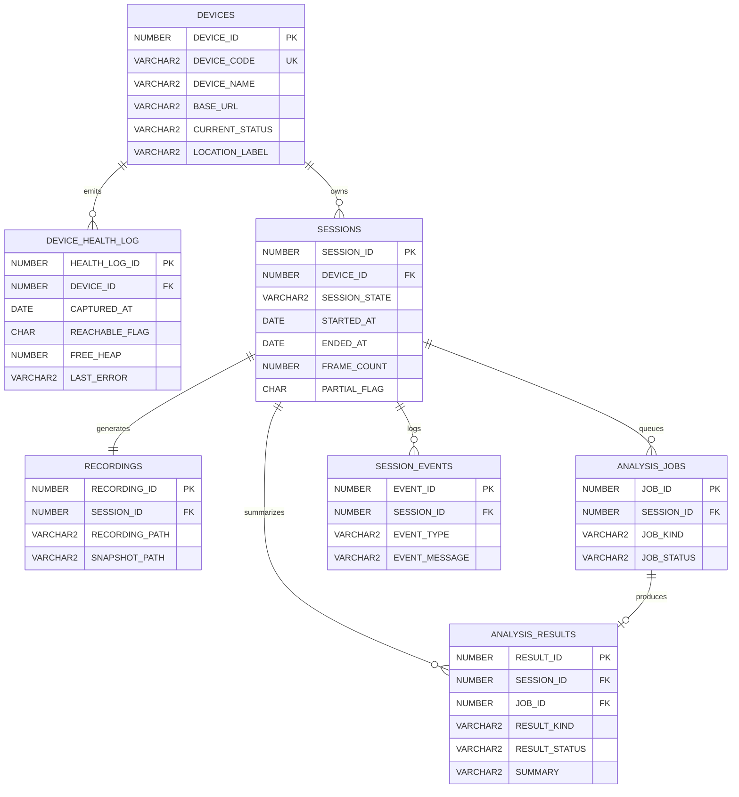
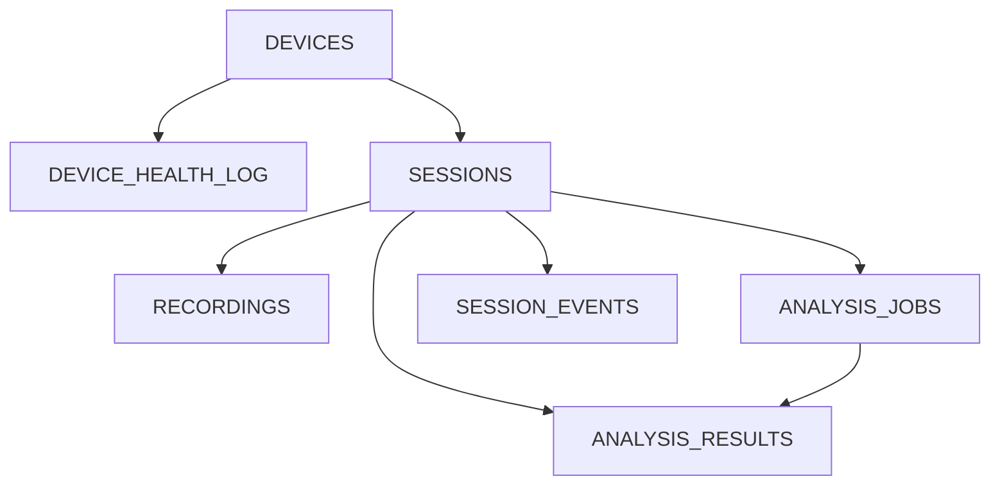

# Assignment No. 1: Title: Case Study and ER diagram.

## Title

Develop a case study and design its Entity Relationship (ER) Diagram. Convert the ER Model into a relational model.

## Theory

Entity-Relationship model is used in the conceptual design of a database (conceptual level, conceptual schema). Design is independent of all physical considerations (DBMS, OS,...).

### Conceptual Design includes

Ideas −→ High-level design −→ Relational database schema −→ Relational DBMS. Questions that are addressed during conceptual design: – What are the entities and relationships of interest (miniworld)-> – What information about entities and relationships among entities needs to be stored in the database-> – What are the constraints (or business rules) that (must) hold for the entities and relationships-> A database schema in the ER model can be represented pictorially (Entity-Relationship diagram):

### Entity Types, Entity Sets, Attributes and Keys

Entity: real-world object or thing with an independent existence and which is distinguishable f rom other objects. Examples are a person, car, customer, product, gene, book etc. • Attributes: an entity is represented by a set of attributes (its descriptive properties), e.g., name, age, salary, price etc. Attribute values that describe each entity become a major part of the data eventually stored in a database. • With each attribute a domain is associated, i.e., a set of permitted values for an attribute. Possible domains are integer, string, date, etc. Entity Type: Collection of entities that all have the same attributes, e.g., persons, cars, customers etc. Entity Set: Collection of entities of a particular entity type at any point in time; entity set is typically referred to using the same name as entity type. Key attributes of an Entity Type • Entities of an entity type need to be distinguishable. A superkey of an entity type is a set of one or more attributes whose values uniquely determine each entity in an entity set. A candidate key of an entity type is a minimal (in terms of number of attributes) superkey. • For an entity type, several candidate keys may exist. During conceptual design, one of the candidate keys is selected to be the primary key of the entity type.

### Relationships, Relationship Types, and Relationship Sets

Relationship (instance): association among two or more entities, e.g., “customer ’Smith’ orders product ’PC42’ ”. Relationship Type: collection of similar relationships An n-ary relationship type R links n entity types E1,.En. Each relationship in a relationship set R of a relationship type involves entities e1 ∈ E1,..., en ∈ En R ⊆ {(e1,..., en) | e1 ∈ E1,..., en ∈ En} where (e1,..., en) is a relationship. Degree of a relationship: refers to the number of entity types that participate in the relationship type (binary, ternary,...). • Roles: The same entity type can participate more than once in a relationship type. EMPLOYEES reports_to supervisor subordinate Role labels clarify semantics of a relationship, i.e., the way in which an entity participates in a relationship. recursive relationship.

### Relationship Attributes

A relationship type can have attributes describing properties of a relationship. “customer ’Smith’ ordered product ’PC42’ on January 11, 2005, for $2345”. These are attributes that cannot be associated with participating entities only, i.e., they make only sense in the context of a relationship. • Note that a relationship does not have key attributes! The identification of a particular relationship in a relationship set occurs through the keys of participating entities. An ER diagram shows the relationship among entity sets. An entity set is a group of similar entities nd hese entities can have attributes. In terms of DBMS, an entity is a table or attribute of a table in database, so by showing relationship among tables and their attributes, ER diagram shows the complete logical structure of a database. Let's have a look at a simple ER diagram to understand this concept

### A simple ER Diagram

In the following diagram we have two entities Student and College and their relationship. The relationship between Student and College is many to one as a college can have many students however a student cannot study in multiple colleges at the same time. Student entity has attributes such as Stu_Id, Stu_Name & Stu_Addr and College entity has attributes such as Col_ID & Col_Name. Here are the geometric shapes and their meaning in an E-R Diagram. We will discuss these terms in detail in the next section(Components of a ER Diagram) of this guide so don’t worry too much about these terms now, just go through them once. Rectangle: Represents Entity sets. Ellipses: Attributes Diamonds: Relationship Set Lines: They link attributes to Entity Sets and Entity sets to Relationship Set Double Ellipses: Multivalued Attributes Dashed Ellipses: Derived Attributes Double Rectangles: Weak Entity Sets Double Lines: Total participation of an entity in a relationship set

### Components of a ER Diagram

Conversion of ER diagram to TableThe database can be represented using the notations, and these notations can be reduced to a collection of tables.In the database, every entity set or relationship set can be represented

The ER diagram is given below

### VisionX case study

VisionX is a smart-glasses monitoring system in which an ESP32-CAM based device streams frames to a host dashboard. The host records sessions, stores health snapshots, queues face and general analysis jobs, saves artifacts, and logs important events.

The following are some points for converting the ER diagram to the table.

- Entity type becomes a table.

In the VisionX ER diagram, DEVICES, DEVICE_HEALTH_LOG, SESSIONS, RECORDINGS, ANALYSIS_JOBS, ANALYSIS_RESULTS and SESSION_EVENTS form individual tables.

- All single-valued attribute becomes a column for the table.

In the DEVICES entity, DEVICE_CODE, DEVICE_NAME, BASE_URL, CURRENT_STATUS and LOCATION_LABEL form the columns of the DEVICES table. Similarly, SESSION_STATE, STARTED_AT and FRAME_COUNT form the columns of the SESSIONS table and so on.

- A key attribute of the entity type represented by the primary key.

In the VisionX ER diagram, DEVICE_ID, HEALTH_LOG_ID, SESSION_ID, RECORDING_ID, JOB_ID, RESULT_ID and EVENT_ID are the key attributes of the entities.

- The multivalued attribute is represented by a separate table.

In VisionX, session events are stored in SESSION_EVENTS as a separate table so multiple timeline records can be associated with a single session.

- Composite attribute represented by components.

In the VisionX design, artifact details are represented through RECORDING_PATH and SNAPSHOT_PATH columns inside the RECORDINGS table.

- Derived attributes are not considered in the table.

In the VisionX design, any live stream duration or dashboard status summary can be derived at runtime and is not stored as a separate derived attribute. Using these rules, you can convert the ER diagram to tables and columns and assign the mapping between the tables. Table structure for the VisionX ER diagram is as below Figure: Table structure

Normalization:- Normalization is a process that “improves” a database design by generating relations that are of higher normal forms.

### The objective of normalization

“to create relations where every dependency is on the key, the whole key, and nothing but the key”. Normalization Rule

The normalization rules are divided into the following normal forms:

1. 1NF is considered the weakest,
2. 2NF is stronger than 1NF,
3. 3NF is stronger than 2NF, and
4. BCNF is considered the strongest.
5. Fourth Normal Form.

any relation that is in BCNF, is in 3NF; any relation in 3NF is in 2NF; and any relation in 2NF is in 1NF.

### First Normal Form (1NF)

If tables in a database are not even in the 1st Normal Form, it is considered as bad database design. For a table to be in the First Normal Form, it should follow the following 4 rules:

1. It should only have single(atomic) valued attributes/columns.

2. Values stored in a column should be of the same domain.

3. All the columns in a table should have unique names.
4. And the order in which data is stored, does not matter.

### Second Normal Form (2NF)

For a table to be in the Second Normal Form,

1. It should be in the First Normal form.

2. And, it should not have Partial Dependency.

Student_id name reg_no branch address • student_id is the primary key and will be unique for every row, hence we can

use student_id to fetch any row of data from this table

• This is Dependency and we also call it Functional Dependency.

### Third Normal Form (3NF)

A table is said to be in the Third Normal Form when, • It is in the Second Normal form. And, it doesn't have Transitive Dependency. subject_id subject_name score_id student_id subject_id marks exam_name total_marks • student_id + subject_id pk • exam_name is dependent on both student_id and subject_id. • total_marks depends on exam_name as with exam type the total score changes • This is Transitive Dependency. When a non-prime attribute depends on other non-prime attributes rather than depending upon the prime attributes or primary key.

### Boyce and Codd Normal Form (BCNF)

Boyce-Codd Normal Form or BCNF is an extension to the third normal form, and is also known as 3.5 Normal Form. For a table to satisfy the Boyce-Codd Normal Form, it should satisfy the following two

The following two conditions should be satisfied:

1. It should be in the Third Normal Form.
2. And, for any dependency A → B, A should be a super key.

## Conclusion

Thus we have studied how to modify E-R Model & Normalization.

## FAQ

1. What is ER Model?
2. Explain in details how to convert ER Diagram to Table Form.
